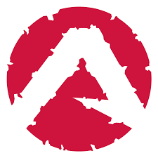
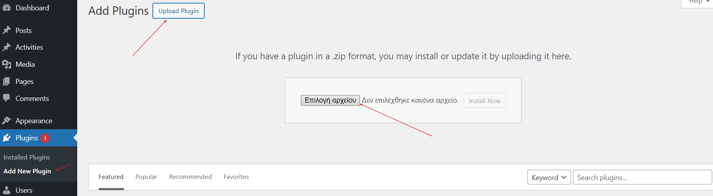
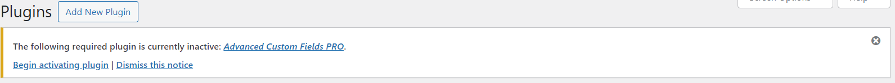
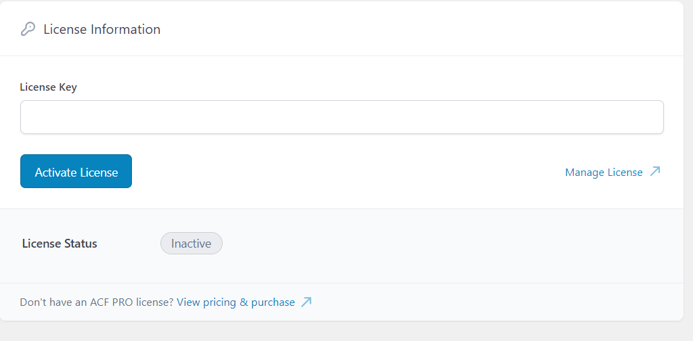
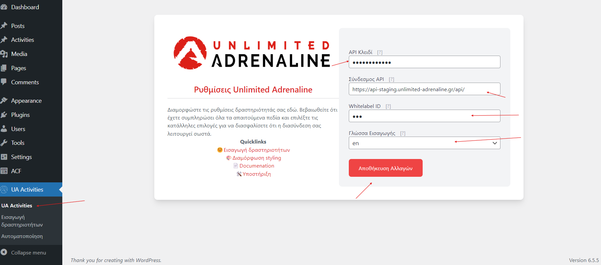
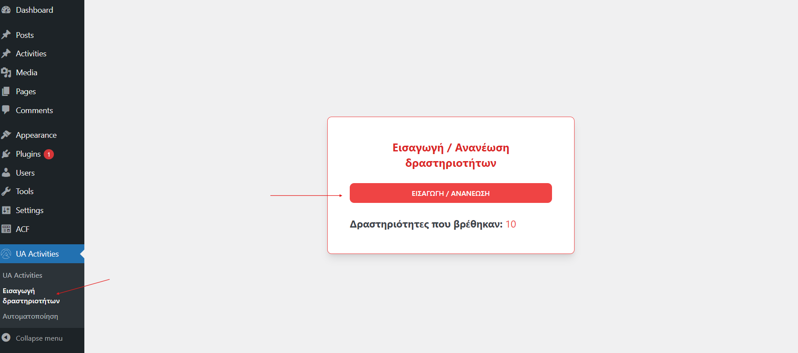
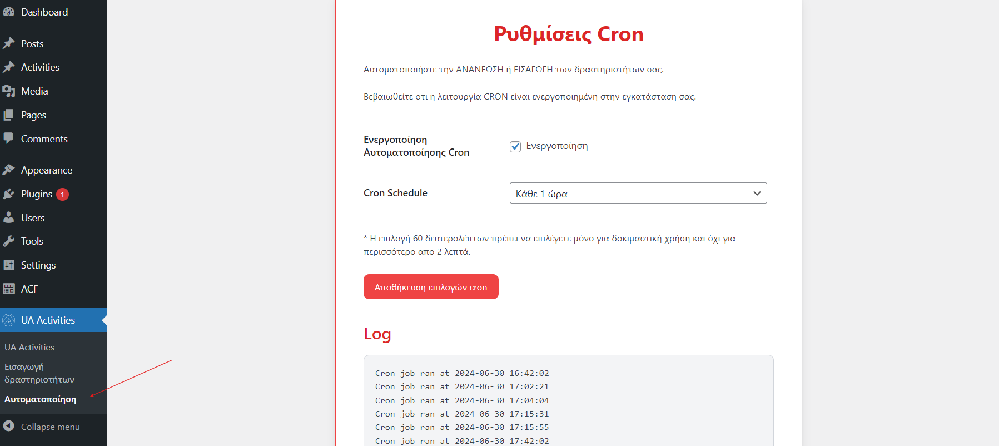
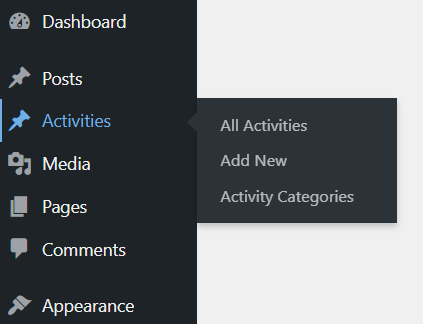
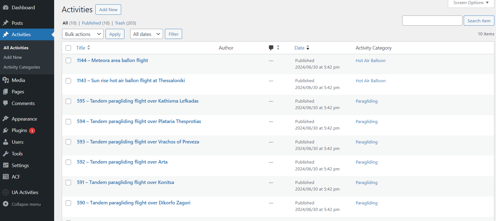

Πίνακας Περιεχομένων:

[[Εισαγωγή]](#εισαγωγή)

[[Εγκατάσταση Plugin]](#εγκατάσταση-plugin)

[[Διασύνδεση]](#διασύνδεση)

> [[Ρυθμίσεις Unlimited
> Adrenaline]](#ρυθμίσεις-unlimited-adrenaline)
>
> [[API Κλειδί]](#api-κλειδί)
>
> [[Σύνδεσμος API]](#σύνδεσμος-api)
>
> [[Whitelabel ID]](#whitelabel-id)
>
> [[Γλώσσα Εισαγωγής]](#γλώσσα-εισαγωγής)
>
> [[Αποθήκευση Αλλαγών]](#αποθήκευση-αλλαγών)

[[Εισαγωγή / Ανανέωση
Δραστηριοτήτων]](#εισαγωγή-ανανέωση-δραστηριοτήτων)

> [[ΕΙΣΑΓΩΓΗ / ΑΝΑΝΕΩΣΗ]](#εισαγωγη-ανανεωση)
>
> [[Δραστηριότητες που
> βρέθηκαν]](#δραστηριότητες-που-βρέθηκαν)

[[Αυτόματη Εισαγωγή / Ανανέωση
Δραστηριοτήτων]](#αυτόματη-εισαγωγή-ανανέωση-δραστηριοτήτων)

> [[Ενεργοποίηση Αυτοματοποίησης
> Cron]](#ενεργοποίηση-αυτοματοποίησης-cron)
>
> [[Cron Schedule]](#cron-schedule)
>
> [[Αποθήκευση επιλογών cron]](#αποθήκευση-επιλογών-cron)
>
> [[Log]](#log)

[[Που βρίσκω τις
δραστηριότητες;]](#που-βρίσκω-τις-δραστηριότητες)

# Εισαγωγή

Έχουμε αναπτύξει μια σύγχρονη και ασφαλή διασύνδεση του Unlimited
Adrenaline με το WordPress, επιτρέποντάς σας να συνδέσετε εύκολα και
γρήγορα το brand που έχετε δημιουργήσει στην πλατφόρμα της Unlimited
Adrenaline με την ιστοσελίδα σας.

Το plugin είναι plug & play, έτοιμο για άμεση χρήση χωρίς περίπλοκες
ρυθμίσεις. Μπορείτε να το βρείτε στην επίσημη ιστοσελίδα της Unlimited
Adrenaline καθώς και στο GitHub.

# Εγκατάσταση Plugin

Βήματα για την εγκατάσταση ενός πρόσθετου WordPress:

1.  **Συνδεθείτε στον Πίνακα Ελέγχου WordPress:** Ανοίξτε τον περιηγητή
    > σας και πληκτρολογήστε το URL του ιστότοπού σας, ακολουθούμενο από
    > \"/wp-admin\" (π.χ., www.example.com/wp-admin). Εισάγετε το όνομα
    > χρήστη και τον κωδικό πρόσβασής σας για να συνδεθείτε.

2.  **Πλοηγηθείτε στα Πρόσθετα:** Από τον πίνακα ελέγχου, εντοπίστε και
    > κάντε κλικ στην επιλογή \"Πρόσθετα\" στο μενού στα αριστερά. Στη
    > συνέχεια, κάντε κλικ στην επιλογή \"Νέο Πρόσθετο\" (Add New) στο
    > επάνω μέρος της σελίδας.

3.  **Μεταφόρτωση Πρόσθετου:** Κάντε κλικ στο κουμπί \"Μεταφόρτωση
    > Πρόσθετου\" (Upload Plugin) που βρίσκεται στο επάνω μέρος της
    > σελίδας.

4.  **Επιλέξτε το Αρχείο:** Κάντε κλικ στο κουμπί \"Επιλέξτε αρχείο\"
    > (Choose File) και εντοπίστε το αρχείο ZIP του πρόσθετου στον
    > υπολογιστή σας. Επιλέξτε το αρχείο ZIP και κάντε κλικ στο κουμπί
    > \"Άνοιγμα\" (Open).

5.  **Εγκατάσταση:** Μετά την επιλογή του αρχείου, κάντε κλικ στο κουμπί
    > \"Εγκατάσταση Τώρα\" (Install Now). Το WordPress θα ανεβάσει και
    > θα εγκαταστήσει το πρόσθετο.

6.  **Ενεργοποίηση του Πρόσθετου:** Μετά την ολοκλήρωση της
    > εγκατάστασης, θα δείτε ένα μήνυμα επιβεβαίωσης. Κάντε κλικ στο
    > κουμπί \"Ενεργοποίηση Πρόσθετου\" (Activate Plugin) για να
    > ενεργοποιήσετε το πρόσθετο και να ξεκινήσετε να το χρησιμοποιείτε.

> 

7.  Θα σας εμφανιστεί το παρακάτω μήνυμα

> 

1.  Πατήστε Begin Installing Plugin

2.  Ακολουθήστε τα βήματα

3.  Αφου το ενεργοποιήσετε θα εμφανιστούν 2 νέες σελίδες\
    > 

4.  Πλοηγηθείτε στο Updates

5.  Εισάγετε το Key: XXXXXXXXXXX

> 

6.  Και πατήστε Activate License\
    > \*Το key έρχεται με lifetime licence δωρεάν για όλους τους πελάτες
    > της U.A.

# Διασύνδεση

### **Ρυθμίσεις Unlimited Adrenaline**

Διαμορφώστε τις ρυθμίσεις δραστηριότητάς σας εδώ. Βεβαιωθείτε ότι έχετε
συμπληρώσει όλα τα απαιτούμενα πεδία και επιλέξτε τις κατάλληλες
επιλογές για να διασφαλίσετε ότι η διασύνδεσή σας λειτουργεί σωστά.

#### **API Κλειδί**

*Συμπληρώστε το API κλειδί σας για να ενεργοποιήσετε τη διασύνδεση με
την πλατφόρμα Unlimited Adrenaline.*

●●●●●●●●●●●●

#### **Σύνδεσμος API**

*Εισάγετε τον σύνδεσμο API για την επικοινωνία με την πλατφόρμα.*

https://api-staging.unlimited-adrenaline.gr/api/

#### **Whitelabel ID**

*Συμπληρώστε το Whitelabel ID σας για να εξατομικεύσετε την εμπειρία
χρήστη.*

●●●

#### **Γλώσσα Εισαγωγής**

*Επιλέξτε τη γλώσσα εισαγωγής των δεδομένων σας.*

en ή gr

#### **Αποθήκευση Αλλαγών**

*Μην ξεχάσετε να αποθηκεύσετε τις αλλαγές σας για να εφαρμοστούν οι νέες
ρυθμίσεις.*

# Εισαγωγή / Ανανέωση Δραστηριοτήτων

Μετά τη συμπλήρωση των API κλειδιών, μπορείτε να προχωρήσετε στην
εισαγωγή ή ανανέωση των δραστηριοτήτων σας από την πλατφόρμα Unlimited
Adrenaline. Αυτή η διαδικασία είναι χειροκίνητη και επιτρέπει την
εισαγωγή νέων δραστηριοτήτων καθώς και την ενημέρωση των υπαρχόντων
δραστηριοτήτων στον ιστότοπό σας.

#### **ΕΙΣΑΓΩΓΗ / ΑΝΑΝΕΩΣΗ**

*Κάντε κλικ στο παρακάτω κουμπί για να εισάγετε ή να ανανεώσετε τις
δραστηριότητές σας. Η λειτουργία αυτή θα εισάγει νέες δραστηριότητες και
θα ενημερώσει τις υπάρχουσες.*

\[ ΕΙΣΑΓΩΓΗ / ΑΝΑΝΕΩΣΗ \]

#### **Δραστηριότητες που βρέθηκαν**

*Αριθμός δραστηριοτήτων που έχουν βρεθεί στην πλατφόρμα Unlimited
Adrenaline και είναι έτοιμες για εισαγωγή ή ανανέωση.*

Δραστηριότητες που βρέθηκαν: Αριθμός ανάλογα το brand σας

# Αυτόματη Εισαγωγή / Ανανέωση Δραστηριοτήτων

Αυτοματοποιήστε την ΑΝΑΝΕΩΣΗ ή ΕΙΣΑΓΩΓΗ των δραστηριοτήτων σας με τη
χρήση της λειτουργίας Cron. Βεβαιωθείτε ότι η λειτουργία Cron είναι
ενεργοποιημένη στην εγκατάστασή σας για να διασφαλίσετε την ομαλή
λειτουργία της αυτοματοποιημένης διαδικασίας.

#### **Ενεργοποίηση Αυτοματοποίησης Cron**

*Επιλέξτε την ενεργοποίηση για να αυτοματοποιήσετε την εισαγωγή ή την
ανανέωση των δραστηριοτήτων σας.*

\[ Ενεργοποίηση \]

#### **Cron Schedule**

*Καθορίστε το χρονικό διάστημα που θέλετε να εκτελείται το Cron job. Η
επιλογή 60 δευτερολέπτων πρέπει να επιλέγεται μόνο για δοκιμαστική χρήση
και όχι για περισσότερο από 2 λεπτά.*

\[ Επιλογές \]

Κάθε 1 ώρα

2 φορές την ημέρα

Καθημερινά -\> 1 φορά την ημέρα

#### **Αποθήκευση επιλογών cron**

*Μην ξεχάσετε να αποθηκεύσετε τις επιλογές σας για να εφαρμοστούν οι
νέες ρυθμίσεις.*

\[ Αποθήκευση επιλογών cron \]

#### **Log**

*Παρακολουθήστε το ιστορικό των εκτελέσεων του Cron job για να
διασφαλίσετε ότι λειτουργεί σωστά.*

# Που βρίσκω τις δραστηριότητες;

Κατά την εγκατάσταση δημιουργείται ένα post type Activities

Επιλέξτε All Activities

# Πως διαμορφώνω το design της δραστηριότητας;
Η διαμόρφωση του design θα χρειαστεί τεχνικές γνώσεις, καλό θα ήταν να το αναθέσετε σε κάποιον προγραμματιστή.
To path του αρχείου είναι: 
/wp-content/plugins/unlimited-andrenaline/single-activity.php
Προτείνουμε την χρήση Tailwind.
Παρόλα αυτά έχουμε μερικές βασικές εύκολες τροποποιήσεις που μπορείτε να κάνετε:

# Λίστα δραστηριοτήτων με Elementor;
Μπορείτε να φτίαξετε την δικιά σας λίστα χρησιμοποιόντας το Elementor ή κάποιο άλλο wordpress builder στα Templates. Χρειάζεται τεχνική γνώση.
Λίστα δραστηριοτήτων με WPBakery;
Μπορείτε να φτίαξετε την δικιά σας λίστα χρησιμοποιόντας το WPBAKERY ή κάποιο άλλο wordpress builder στα Templates. Χρειάζεται τεχνική γνώση.
# Πως μπορώ να βάλω Φίλτρα;
Το ACF pro το οποίο λαμβάνετε δωρεάν σαν πελάτες την Unlimited Andrenaline υποστηρίζει φίλτρα, μπορείτε να χρησιμοποιήσετε το ήδη υπάρχων plugin φιλτραρίσματος σας ή κάποιο απο τα παρακάτω:
FacetWP, WP Gridbuilder, Search & Filter Pro
Διαβάστε περισσότερα εδώ: https://support.advancedcustomfields.com/forums/topic/filter-and-search-acf-fields/
